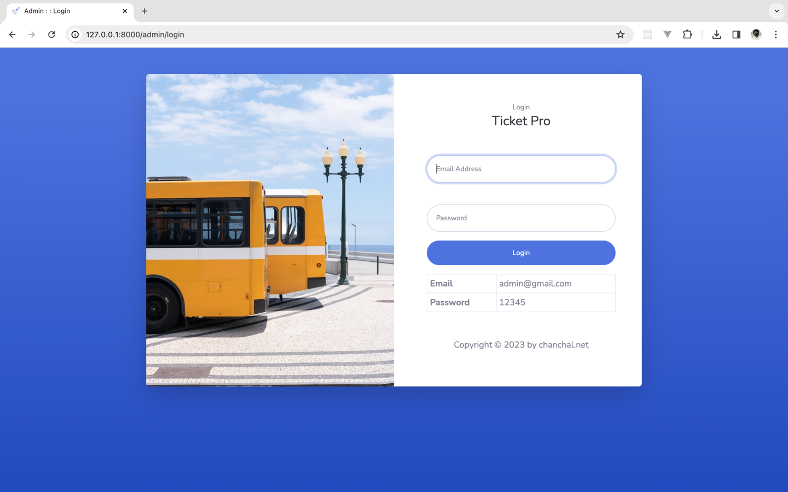
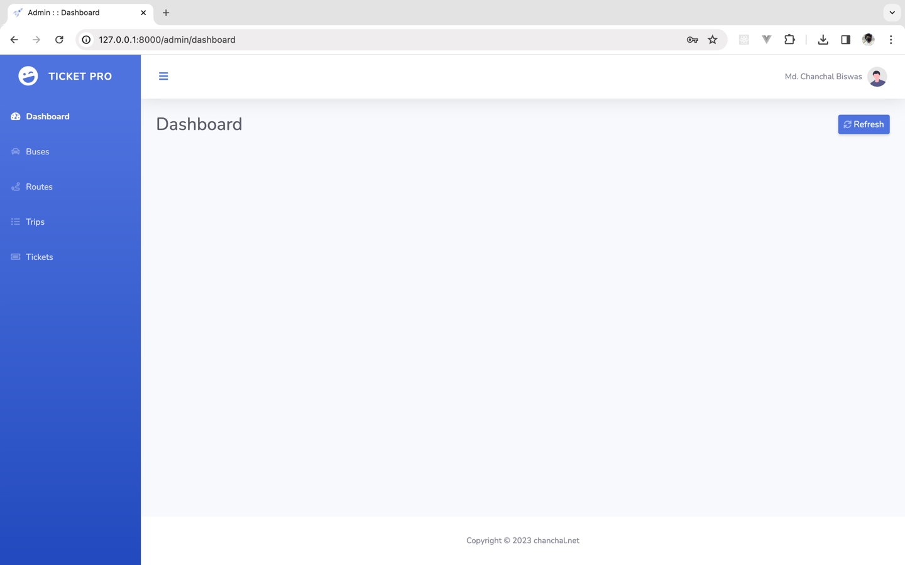
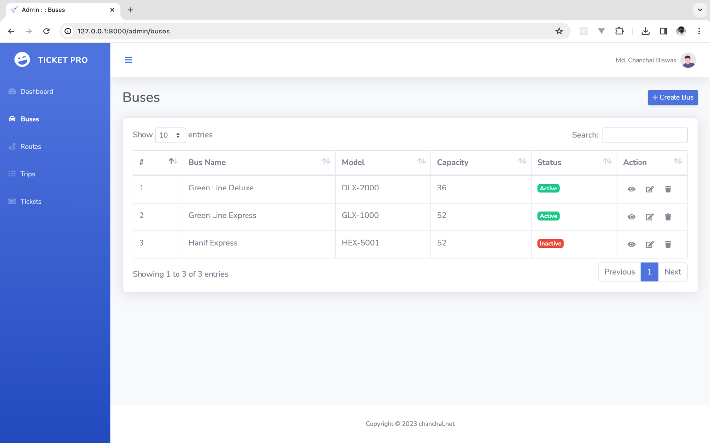
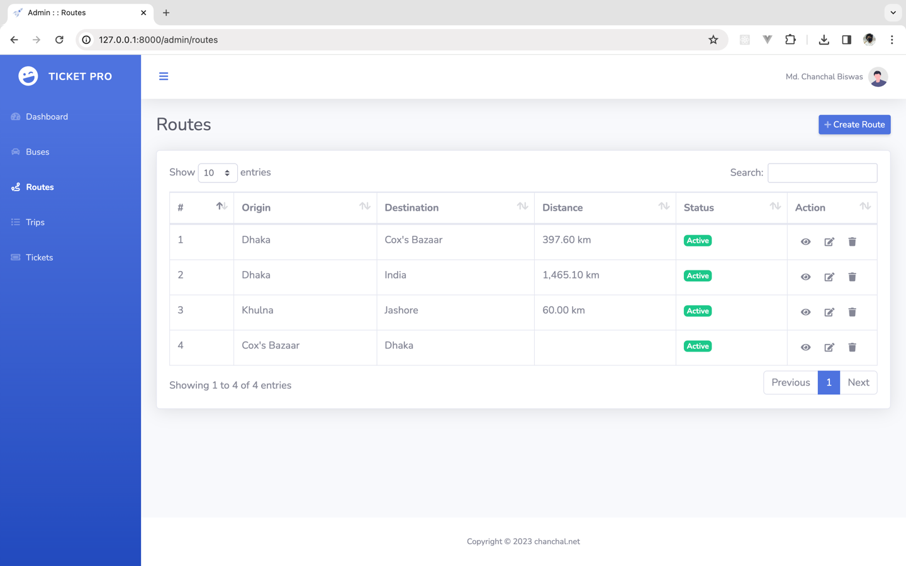
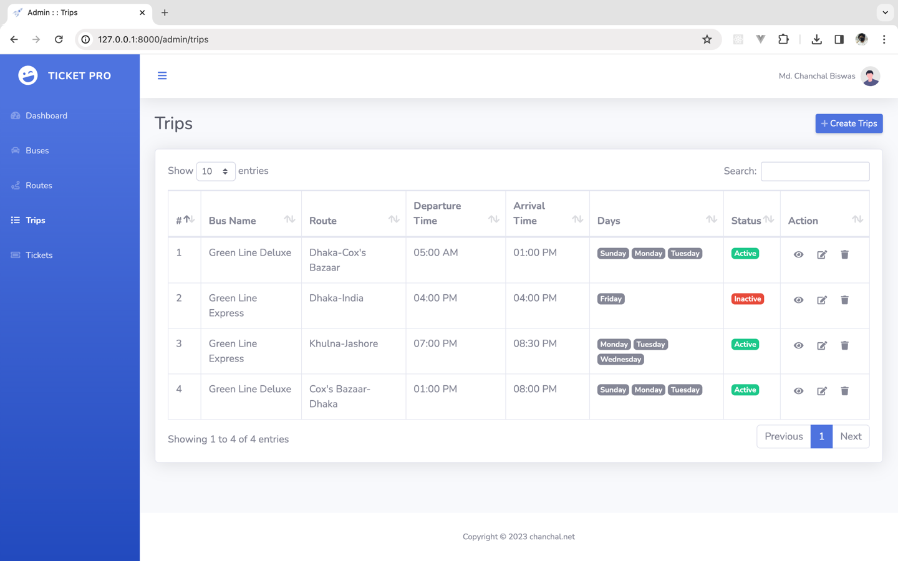
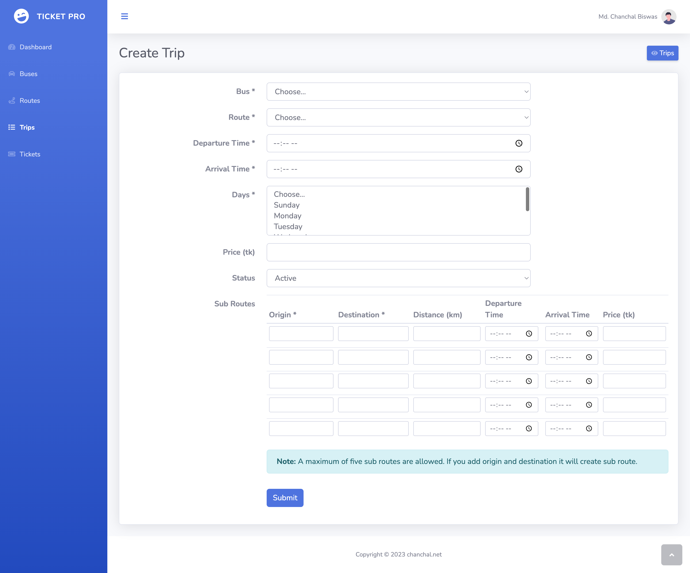
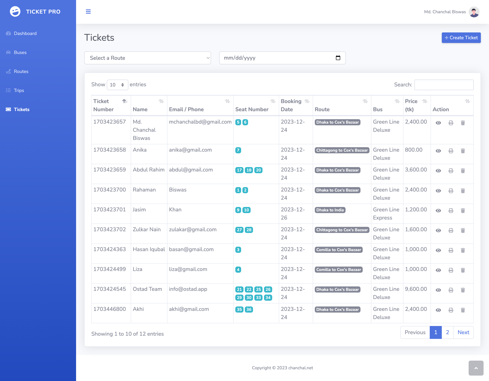
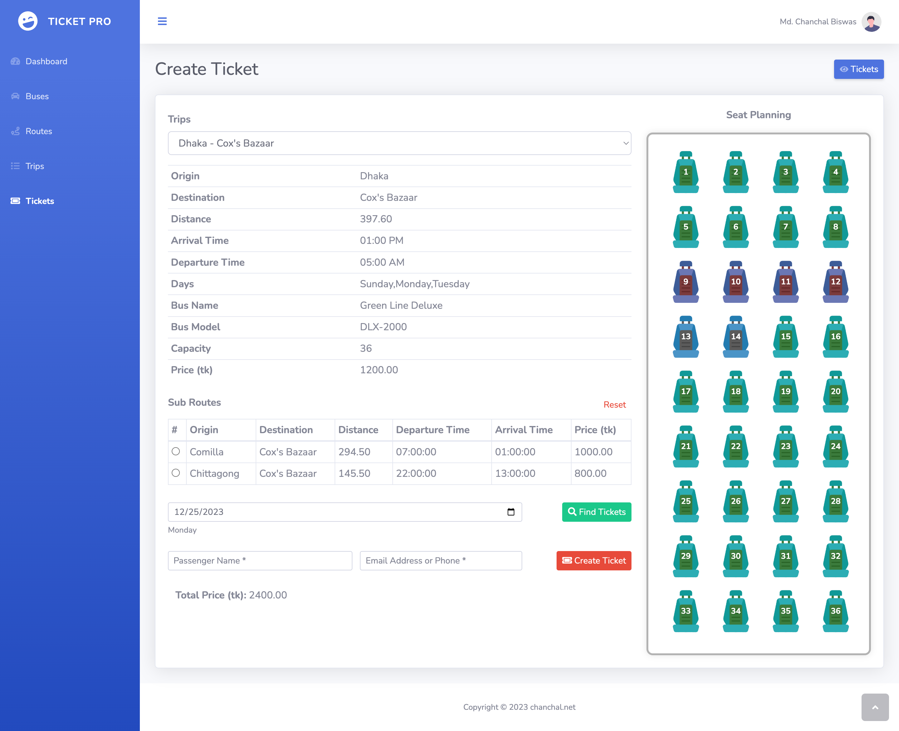
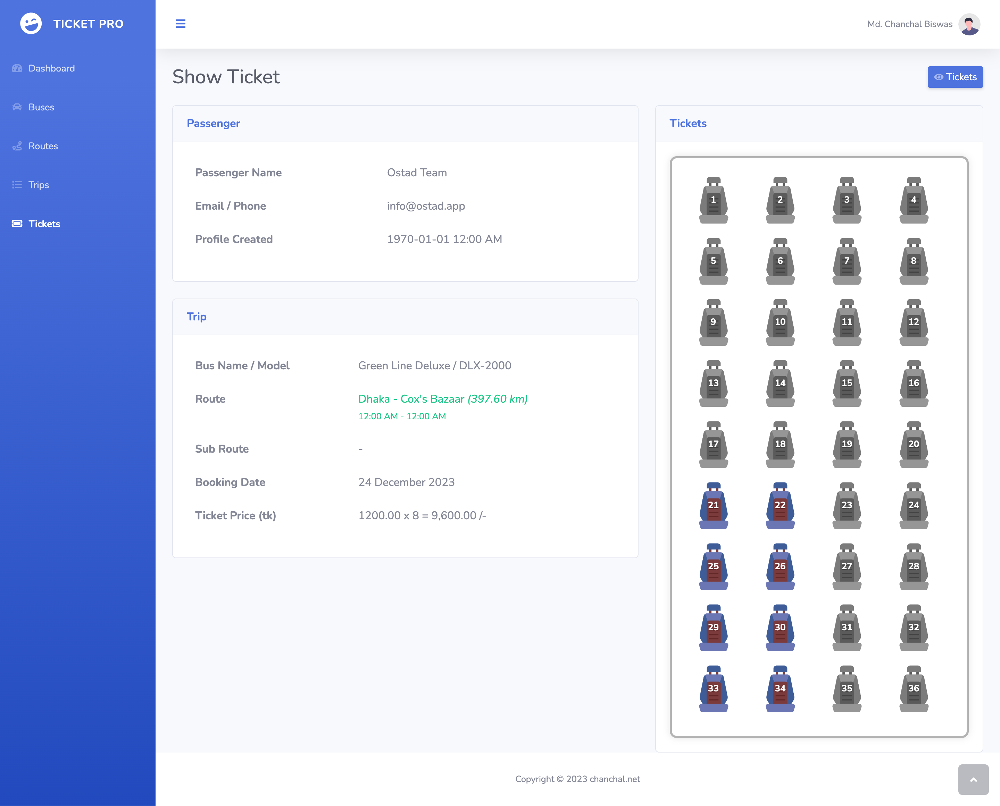

# Module 12 Assignment

Assume A bus belongs to you. Your bus driver is quite astute. You would like to sell tickets online. It is your 
responsibility to create the Tiki  online ticketing system.Your bus will go from Dhaka to Cox's Bazaar, with a 
round-trip stop in Dhaka, Comilla, Chittagong, and Cox's Bazaar. Make a Laravel project using a model view controller(MVC)

1. You must make a trip using a form on a certain day.
2. A user can then look for a date and, if a seat is available, purchase a ticket for the position of his choice. There 
   are 36 seats on the bus.
3. You must preserve the user data.
4. You have to make a location table, user table, trip table,seat_allocation table, etc


### Submission Guidelines:

1. Create a new fresh Laravel project
2. Complete the task
3. Submit Github Url

### Project Setup
Open the terminal and run the following commands:
```text
git clone https://github.com/net-chanchal/ostad_module12_assignment.git
cd ostad_module12_assignment
composer update
```

### Environment Setup

1. Create a Database `ostad_module12_assignment`
2. Modify the `.env` file if necessary.
3. Run the following commands or follow step 3:  
```text
php artisan migrate
php artisan db:seed
```
4. If needed, you can manually import the database `database/ostad_module12_assignment.sql`


### Run the Development Server
To start the Laravel development server, execute the following command:
```text
php artisan serve
```

### Test the Route
Visit the following URL in your web browser to test the route:
```text
http://127.0.0.1:8000
```

### Project Screenshots

__Login:__


__Dashboard:__


__Buses:__

_Note:_ Create, Edit and Delete is available.

__Routes:__

_Note:_ Create, Edit and Delete is available.

__Trips:__

_Note:_ Create, Edit and Delete is available.

__Trip Create:__


__Tickets:__


__Ticket Create:__


__Ticket Create:__

